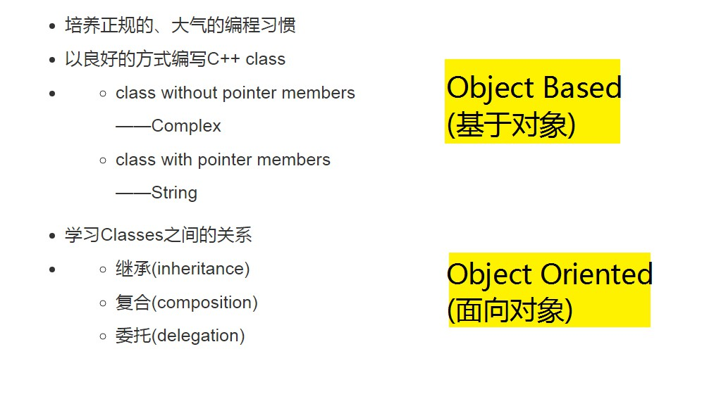

### 具备基础：

* 曾经学过某种**procedural language**(C语言最佳)
* * **变量(variables)**
  * **类型(types)**: int , float ,char ,struct ...
  * **作用域(scope)**
  * **循环(loops)** :while , for
  * **流程控制**:if-else ,switch-case
* 知道一个程序序言编译，链接才能被执行
* 知道如何编译和链接（如何建立一个可执行程序）

------



```
获得代码：
	complex.h
	complex-test.cpp

	string.h
	string-test.cpp

	oop-demo.h
	oop-test.cpp
```


* B语言 1969
* C语言 1972
* C++语言 1983
* * new C -> C with Class -> C++
* Java语言
* C#语言


* C++ 98(1.0)    大部分人用的
* C++ 03(TR1,Technical Report 1)
* C++ 11(2.0)
* C++ 14


《C++ Primer》《THE C++ PROGRAMMING LANGUAGE》

《Effecitive C++》 

《THE C++ STANDARD LIBRARY》《STL源码剖析》


